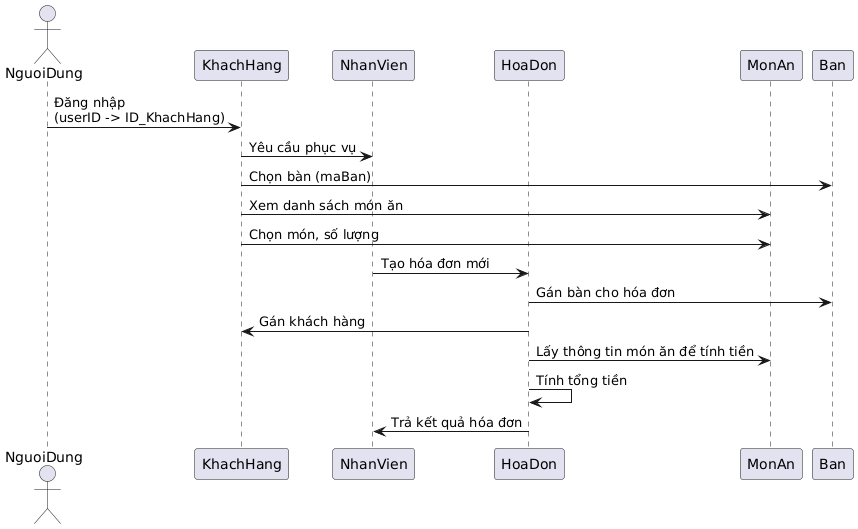
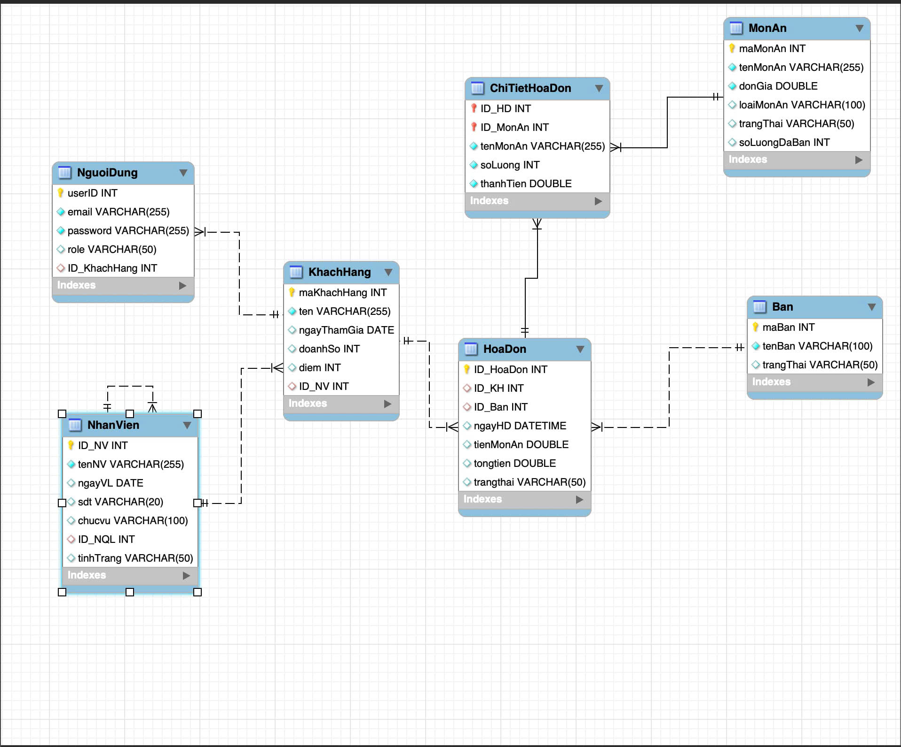
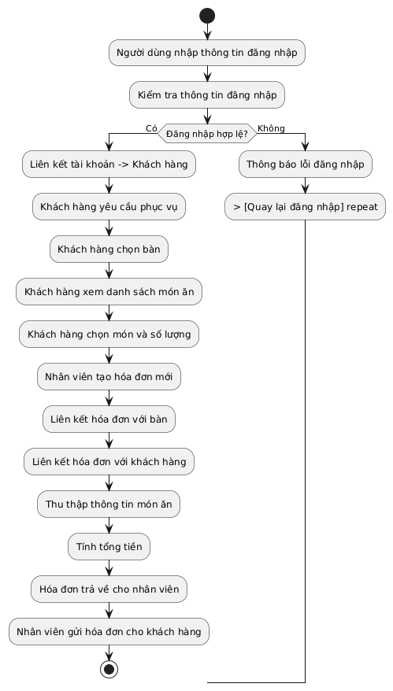

# Group3_OOP_N02_term3_2025
OOP-Group-3

#XÂY DỰNG ỨNG DỤNG QUẢN LÝ NHÀ HÀNG (RESTAURANT MANAGEMENT)

#1.Thành viên:

1.Vũ Thành Trung

github id: thanhtrung2512

2.Trần Tiến Thành

github id: TranTienThanh26

3.Nguyễn Văn Dũng

github id: dungpnk

#2.Tiêu đề:
QUẢN LÝ NHÀ HÀNG

#3.Đối tượng:

MonAn(maMonAn,tenMonAn,donGia,loaiMonAn,trangThai)

BanAn(MaBan,TenBan,trangthai)

DonGoiMon(maDon,maBan,maKH,thoiGianGoi,trangThai)

HoaDon(idHoaDon,idBan,tienMonAn,tongtien)

#QUẢN LÝ NHÀ HÀNG

public class MonAn {

    private int maMonAn;
    private String tenMonAn;  // Tên món ăn
    private int donGia;     // Đơn giá
    private String loaiMonAn;   // Loại món ăn (ví dụ: Khai vị, Món chính, Tráng miệng)
    private String trangThai;;
    private double gia;
  
public class Ban {

    private int maBan;     // Mã bàn
    private String tenBan;   // Tên bàn
    private String trangThai; // Trạng thái bàn (Ví dụ: Trống, Đã đặt, Đang phục vụ)

 public class DonGoiMon {

    private int maDon;
    private int maBan;
    private int maKH;
    private String thoiGianGoi;
    private String trangThai; // Ví dụ: Mới, Đã xác nhận, Đang chuẩn bị, Đã xong, Hủy

public class HoaDon {

   private int idHoaDon;
    private int idKH;
    private int idBan;
    private String ngayHD;
    private int tienMonAn;
    private String code_voucher;
    private int tienGiam;
    private int tongtien;
    private String trangthai;

    
#Yêu cầu:

- Giao diện Java Spring Boot.
  
- Có chức năng quản lý NHÀ HÀNG

#Phương thức hoạt động 

+ Thêm, sửa, xóa Món Ăn

+ Liệt kê thông tin về Món Ăn , có thể lọc ra các món ăn theo từng loại.
  
- Có chức năng quản lý trong hệ thống thực đơn.

+ Thêm, sửa, xóa thông tin Bàn Ăn
  
- Có chức năng gán món ăn cho bàn ăn

- Dữ liệu được lưu trữ xuống file nhị phân

+ Cần tạo các lớp liên quan đến Món ăn, Bàn ăn, và Nhân viên để đọc, ghi xuống 1 hay nhiều file.

- Khi làm việc với dữ liệu trong bộ nhớ, dữ liệu cần được lưu trữ dưới dạng các Collection tùy chọn như ArrayList, LinkedList, Map, ....

- Sinh viên có thể thêm các chức năng vào chương trình để ứng dụng phong phú hơn bằng cách thêm các nghiệp vụ cho bài toán (tùy chọn)

1.1: UML Sequence Diagram :

1.2: UML Class Diagram :

.
