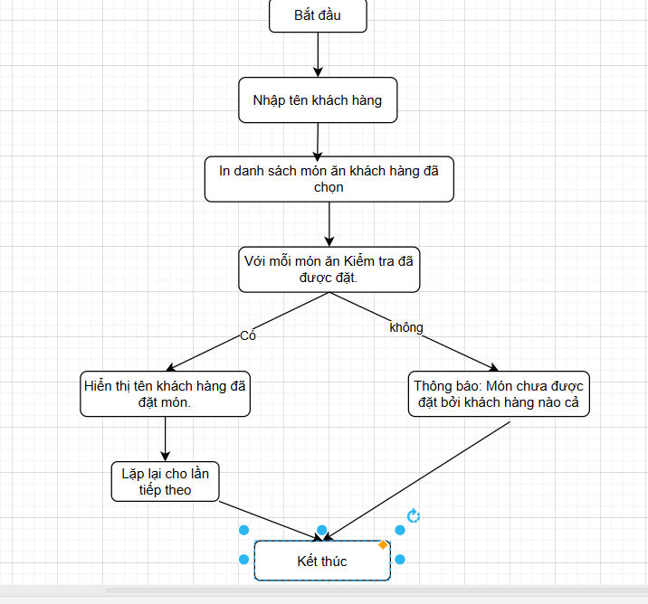

# Group3_OOP_N02_term3_2025
OOP-Group-3

# Hệ thống quản lý nhà hàng - TTD Restaurant


## Mục tiêu của đề tài
Xây dựng hệ thống Quản lý Nhà Hàng một cách chuyên nghiệp, linh hoạt, có thể quản lý và lưu trữ được một lượng dữ liệu lớn. Hệ thống giúp người dùng dễ dàng hơn trong việc tổ chức, quản lý dữ liệu Khách hàng, quản lý Đặt bàn, quản lý Thực đơn,… và nhiều hơn thế nữa.

## Nhóm Thực Hiện : The Dreamers

| STT | Họ tên              | GitHub ID         |
|-----|---------------------|-------------------|
| 1   | Vũ Thành Trung      | thanhtrung2512    |
| 2   | Trần Tiến Thành     | TranTienThanh26   |
| 3   | Nguyễn Văn Dũng     | dungpnk           |

## Các chức năng chính trong ứng dụng
----------------
### Chức năng chính cho khách hàng
> * Đăng nhập
> * Đăng ký tài khoản
> * Đặt bàn và gọi món
> * Đổi điểm tích lũy
> * Quản lý thông tin cá nhân 
> * Xem lịch sử hóa đơn

### Chức năng nhân viên (bao gồm cả nhân viên tiếp tân, nhân viên kho và quản trị viên)
>*  Đăng nhập
>*	Quản lý Bàn 
>*	Quản lý Món Ăn
>*	Quản lý Nhân Sự
>*	Quản lý khách hàng

## Demo Sản Phẩm


**#2. Tiêu đề:**  
**QUẢN LÝ NHÀ HÀNG**

**I. Class Người Dùng (NguoiDung)**  
**Miêu tả thông tin của người dùng:**

 • **UserID**: Mã người dùng  
 • **Email**: Địa chỉ email (duy nhất)  
 • **MatKhau**: Mật khẩu đăng nhập  
 • **VerifyCode**: Mã xác minh (nếu có)  
 • **TrangThai**: Trạng thái hoạt động (Active / Inactive)  
 • **VaiTro**: Loại người dùng (Khách hàng, Nhân viên, Admin, ...)

**Phương thức hoạt động liên quan đến người dùng:**

 • Đăng ký, đăng nhập bằng email  
 • Phân quyền theo vai trò  
 • Kết nối với bảng KhachHang hoặc NhanVien để mở rộng thông tin  
 • Duy trì trạng thái tài khoản


**II. Class Khách Hàng (KhachHang)**  
**Miêu tả thông tin khách hàng:**

 • **MaKhachHang**: Mã khách hàng  
 • **TenKH**: Tên khách hàng  
 • **NgayThamGia**: Ngày bắt đầu sử dụng dịch vụ  
 • **DoanhSo**: Tổng chi tiêu  
 • **Diem**: Điểm thưởng  
 • **UserID**: Liên kết đến người dùng (nếu có)

**Phương thức hoạt động liên quan đến khách hàng:**

 • Hiển thị thông tin khách hàng  
 • Tính tổng doanh số, điểm thưởng  
 • Đặt bàn, thanh toán hóa đơn


**III. Class Nhân Viên (NhanVien)**  
**Miêu tả thông tin nhân viên:**

 • **Id_NV**: Mã nhân viên  
 • **TenNV**: Họ tên  
 • **NgayVL**: Ngày vào làm  
 • **Sdt**: Số điện thoại  
 • **ChucVu**: Chức vụ (Phục vụ, Đầu bếp, Quản lý, …)  
 • **Id_NQL**: ID người quản lý trực tiếp  
 • **TinhTrang**: Trạng thái công việc  
 • **UserID**: Liên kết đến tài khoản người dùng

**Phương thức hoạt động liên quan đến nhân viên:**

 • Quản lý thông tin nhân viên  
 • Theo dõi tình trạng làm việc  
 • Phân công nhiệm vụ  
 • Truy xuất theo quản lý


**IV. Class Bàn (Ban)**  
**Miêu tả thông tin bàn:**

 • **MaBan**: Mã bàn  
 • **TenBan**: Tên hoặc số bàn  
 • **TrangThai**: Trạng thái (Trống, Đã đặt, Đang phục vụ, Đang dọn dẹp)

**Phương thức hoạt động liên quan đến bàn:**

 • Hiển thị danh sách bàn  
 • Cập nhật trạng thái bàn  
 • Phân công bàn theo hóa đơn


**V. Class Món Ăn (MonAn)**  
**Miêu tả thông tin món ăn:**

 • **MaMonAn**: Mã món ăn  
 • **TenMonAn**: Tên món  
 • **DonGia**: Giá tiền  
 • **LoaiMonAn**: Loại (Món chính, Món phụ, Nước, …)  
 • **TrangThai**: Trạng thái (Đang kinh doanh, Hết hàng, Ngừng kinh doanh)  
 • **SoLuongDaBan**: Thống kê số lần bán  
 • **HinhAnh**: Hình ảnh món ăn

**Phương thức hoạt động liên quan đến món ăn:**

 • Hiển thị danh sách món ăn  
 • Cập nhật trạng thái và số lượng  
 • Quản lý thực đơn


**VI. Class Hóa Đơn (HoaDon)**  
**Miêu tả thông tin hóa đơn:**

 • **IdHoaDon**: Mã hóa đơn  
 • **IdKH**: Mã khách hàng  
 • **IdBan**: Mã bàn ăn  
 • **NgayHD**: Ngày tạo hóa đơn  
 • **TienMonAn**: Tổng tiền món ăn  
 • **TongTien**: Tổng cộng (bao gồm thuế, dịch vụ nếu có)  
 • **TrangThai**: Trạng thái (Chưa thanh toán, Đã thanh toán, Đã huỷ, Đang chờ)

**Phương thức hoạt động liên quan đến hóa đơn:**

 • Tạo hóa đơn mới  
 • Gắn hóa đơn với khách hàng và bàn  
 • Cập nhật trạng thái hóa đơn  
 • Tính tổng tiền


**VII. Class Chi Tiết Hóa Đơn (CTHD)**  
**Miêu tả thông tin chi tiết hóa đơn:**

 • **ID_CTHD**: Mã chi tiết hóa đơn  
 • **ID_HD**: Mã hóa đơn  
 • **ID_MonAn**: Mã món ăn  
 • **SoLuong**: Số lượng món  
 • **DonGia**: Giá đơn vị  
 • **ThanhTien**: Thành tiền = SoLuong × DonGia

**Phương thức hoạt động liên quan đến chi tiết hóa đơn:**

 • Tạo dòng chi tiết khi thêm món vào hóa đơn  
 • Cập nhật số lượng & giá theo thực tế  
 • Tính tổng hóa đơn  
 • Hiển thị danh sách món trong 1 hóa đơn


  📁 Cấu trúc thư mục Project:

```
Project/
├── .vscode/
├── bin/
├── src/
│   ├── Main.java
│   ├── Ban.java
│   ├── CTHD.java
│   ├── HoaDon.java
│   ├── KhachHang.java
│   ├── MonAn.java
│   ├── NguoiDung.java
│   └── NhanVien.java
├── test/
│   ├── TestBan.java
│   ├── TestCTHD.java
│   ├── TestHoaDon.java
│   ├── TestKhachHang.java
│   ├── TestMonAn.java
│   ├── TestNguoiDung.java
│   └── TestNhanVien.java
├── README.md
  
```
 

 **Để kiểm tra tính đúng đắn và độ ổn định của hệ thống quản lý nhà hàng, chúng tôi thực hiện kiểm thử cho các chức năng chính của từng lớp như sau:

1. Lớp NguoiDung, KhachHang, NhanVien:
Kiểm thử các chức năng như đăng ký, đăng nhập, hiển thị thông tin người dùng, phân quyền theo vai trò, và cập nhật trạng thái tài khoản.

2. Lớp Ban:
Kiểm tra việc tạo mới, hiển thị danh sách bàn ăn, cập nhật trạng thái bàn theo thời gian thực và phân bổ bàn vào hóa đơn.

3. Lớp MonAn:
Kiểm thử các thao tác như thêm món ăn, hiển thị danh sách món, cập nhật thông tin và trạng thái món ăn, đồng thời xử lý các tình huống như hết hàng.

4. Lớp HoaDon:
Thực hiện kiểm thử tạo hóa đơn mới, hiển thị thông tin hóa đơn, tính tổng tiền, cập nhật trạng thái và đảm bảo kết nối đúng với các bảng liên quan như bàn và khách hàng.

5. Lớp CTHD (Chi Tiết Hóa Đơn):
Kiểm thử việc tạo dòng chi tiết hóa đơn khi khách gọi món, tính thành tiền, cập nhật số lượng và hiển thị danh sách món đã gọi theo từng hóa đơn.


## ✨ Nội dung đề tài:

Xây dựng ứng dụng **quản lý nhà hàng** chuyên nghiệp, hỗ trợ quản lý người dùng, khách hàng, nhân viên, bàn ăn, món ăn, hóa đơn và chi tiết hóa đơn.

---

## 🎯 Yêu cầu tổng quan:

- Giao diện ứng dụng xây dựng bằng **Java Spring Boot**.
- Có chức năng **quản lý toàn bộ hoạt động của nhà hàng**, bao gồm:
  - Người dùng
  - Khách hàng
  - Nhân viên
  - Bàn ăn
  - Món ăn
  - Hóa đơn
  - Chi tiết hóa đơn
- Dữ liệu được lưu trữ bằng **file nhị phân**.
- Sử dụng các **Collection** như `ArrayList`, `HashMap`, `LinkedList`,... để xử lý dữ liệu trong bộ nhớ.
- Tạo đầy đủ các **class** để xử lý và lưu trữ dữ liệu vào file.

---

## 🔹 Chức năng quản lý người dùng (NguoiDung):

- Thêm, sửa, xóa người dùng.
- Phân quyền người dùng theo vai trò: Khách hàng, Nhân viên, Quản lý, Admin.
- Liên kết người dùng với bảng Khách hàng hoặc Nhân viên.
- Kiểm soát trạng thái tài khoản (hoạt động / không hoạt động).

---

## 🔹 Chức năng quản lý khách hàng (KhachHang):

- Thêm, sửa, xóa khách hàng.
- Hiển thị thông tin khách hàng (họ tên, doanh số, điểm).
- Tính điểm tích lũy và tổng chi tiêu.
- Gắn khách hàng với hóa đơn.

---

## 🔹 Chức năng quản lý nhân viên (NhanVien):

- Thêm, sửa, xóa nhân viên.
- Quản lý thông tin nhân viên (chức vụ, tình trạng, người quản lý).
- Phân công công việc theo chức năng.
- Gắn tài khoản `NguoiDung` cho từng nhân viên.

---

## 🔹 Chức năng quản lý bàn ăn (Ban):

- Hiển thị danh sách bàn ăn.
- Cập nhật trạng thái bàn (Trống, Đã đặt, Đang phục vụ, Đang dọn dẹp).
- Gắn bàn với hóa đơn theo thời gian thực.

---

## 🔹 Chức năng quản lý món ăn (MonAn):

- Thêm, sửa, xóa món ăn.
- Hiển thị chi tiết thông tin món ăn (giá, loại, trạng thái, ảnh).
- Cập nhật số lượng đã bán và trạng thái kinh doanh.

---

## 🔹 Chức năng quản lý hóa đơn (HoaDon):

- Tạo Hóa Đơn
- Gắn hóa đơn với khách hàng và bàn ăn.
- Tính tổng tiền đơn hàng.
- Cập nhật trạng thái hóa đơn (Chưa thanh toán, Đã thanh toán, Đã hủy...).

---

## 🔹 Chức năng quản lý chi tiết hóa đơn (CTHD):

- Thêm món ăn vào hóa đơn (chi tiết).
- Cập nhật số lượng và đơn giá theo món.
- Tính thành tiền từng món và toàn bộ hóa đơn.
- Hiển thị danh sách món ăn theo từng hóa đơn.


1.1: UML Sequence Diagram :
 

1.2: UML Class Diagram :


1.3: Activity Diagram :
.


**Lưu đồ thuật toán của phương thức chính: Thông báo danh sách món ăn đã được đặt bởi khách hàng: 



Phân công công việc:

Thành viên &	Nhiệm vụ:

-Trung:	    In danh sách món ăn đã đặt của khách hàng.

-Dũng:	    Kiểm tra món ăn đã được thanh toán hay chưa.

-Thành:	    Hiển thị tên khách hàng đặt món.


